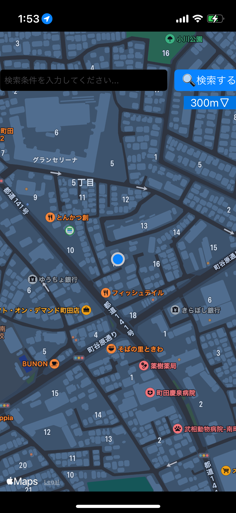
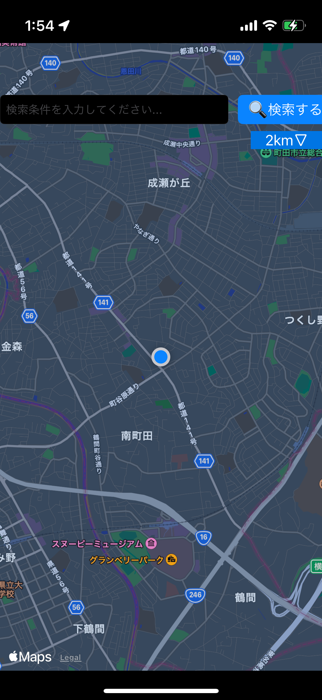
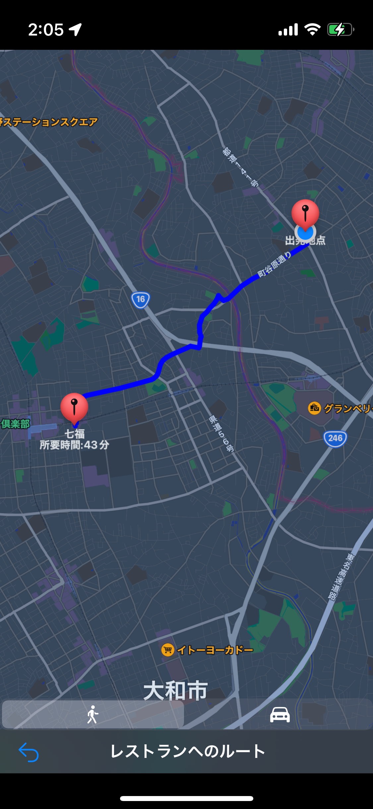

# 簡易仕様書
## アプリ名
RestaurantSearcherGPS
## 対象OS
iOS 15.6
## 開発環境
Xcode Version 15.2
## 言語
Swift 5.9.2
## 開発期間
2/14-2/26 13日間　48時間程度
## 機能概要
GPSを利用して、自分の周辺に存在するHotPepperAPIに登録されている飲食店を検索することが可能です。

自由に検索条件を入力できる他、現在地からの検索半径を入力することが可能となります。

検索したのち、入力した条件に一致する飲食店が一端で表示され、画面をタップすることで対応したレストランの名称、予算、住所などが表示されます。

また、選択したレストランまでの経路および到着までかかる時間を表示する機能があります。

## 画面概要

### 起動画面
起動した時に表示される画面です。

画面上の任意の箇所をタップすることで次の検索条件入力画面に遷移します。また、この画面で位置情報を使用することの許可をとります。

### 検索条件入力画面

起動画面から遷移する画面です。ここで検索する条件を入力します。

検索する! と記載されたボタンを押下することで検索結果画面に遷移します。

テキストフィールドに文字を入力することで検索条件を追加することができます。

検索する!ボタンの下に存在するボタンを押下することで、検索半径をセットすることができます。また、このボタンを利用して検索半径を設定した際、概ねその検索半径に一致するように画面のマップの縮尺が変更されます。

|||

### 検索結果画面

検索条件入力画面から遷移する画面です。ここで検索した結果が表示されます。

この画面では、検索条件入力画面で入力された条件をもとにAPIからレスポンスとして帰ってきた飲食店の画像、店名、アクセスが表示されます。

各行をタップすることで対応した飲食店の店舗詳細画面に遷移します。

### 店舗詳細画面

検索結果画面から遷移する画面です。

遷移前の画面でタップされた飲食店に対応した店名、画像、住所、予算が表示されます。

画面上の表の一番下の行にある「現在地から経路を調べる」と書かれたセルをタップすることで飲食店への経路を表示する画面へと遷移します。

### 経路表示画面

店舗詳細画面から遷移する画面です。

遷移前の画面で表示されていた飲食店への経路、および所要時間を表示します。

また、下部に設置されている人と車のボタンをタップした際、それぞれに対応した経路と所要時間が表示されます。

## 使用したライブラリ
Alamofire

## コンセプト

手軽に調べられ、迷うことなく飲食店にたどり着けるアプリ

## こだわったポイント

ユーザが操作したことでどのような結果が得られたのかを必ず画面内に表示するようにしました。

最たる例として、検索条件入力画面に搭載した検索範囲を設定するボタンです。このボタンを操作した際に画面上に何も変化が起きなかった場合、何を持ってこの数値が与えられているのかユーザが理解し難いですが、ボタンを操作した際に画面の縮尺が変更されることで検索する範囲を変更したのだということを視覚的にわかりやすくしました。

## デザイン面でこだわったポイント

ユーザが操作することができるものはわかりやすくするように心がけました。

検索条件入力画面では、入力フィールド、検索ボタン、検索範囲設定ボタンの三つがユーザによって操作することが可能です。

入力フィールドにはプレースホルダーを用いて入力することが可能であることを示し、検索ボタンは虫眼鏡のマークを配置することでボタンとして機能していることを示しています。最後に検索範囲設定ボタンでは、範囲だけでなく、逆三角形を右側に配置することで案に他にも候補があることを示し、タップする操作を誘引する役割を果たしています。

以上などのように、ユーザが操作することができる点についてはできる限りわかりやすく表示することを意識しました。

## アドバイスして欲しいポイント

検索結果画面が著しく閲覧性が悪いため、どのように改善すべきかをお伺いしたいです。今回は表形式で表示しました。可読性確保のため、文字のサイズを確保すると一覧性が悪くなり、場合によっては文字が入りきらない問題が発生しました。文字のサイズを自動変更する機能はありますが、自動改行が実施される場合、動作しないようで、ユーザビリティがあまり良くない状態になっています。

そのため、この画面をどうデザインすべきかという点についてアドバイスをいただきたいです。

## 自己評価

検索結果画面を除けば概ね満足する出来のアプリケーションを作成することができました。要求仕様を満たすことができ、デザイン面では特に検索条件入力画面は今まで作成したアプリケーションの中で一番良くできたと考えています。

改善点としては、検索結果画面などで使用されている画像を取得する関数が非同期で画像を取得していないので、現状の表示数では問題ないものの、今後表示数などが多くなることを考慮すると非同期的に取得するように変更を実施したいです。
